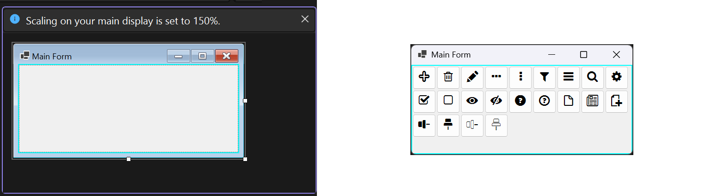

# [<](../../README.md)


## WinForms Quick Start

The designer sets up an empty `FlowLayoutPanel`. The `InitAsync` method populates it with iconic buttons at runtime. WinForms loads custom fonts through `System.Drawing.PrivateFontCollection` (handled automatically by the platform-specific NuGet package). Every glyph-bearing control must set `UseCompatibleTextRendering = true` - without it, WinForms will not render Unicode PUA glyphs at all.




```
using IVSoftware.Portable;
using IVSoftware.WinForms;
// <PackageReference Include="IVSoftware.GlyphProvider.WinForms" Version="1.0.0-*" />

namespace QuickStart.WinForms.Demo
{
    public partial class MainForm : Form
    {
        public MainForm()
        {
            InitializeComponent();
            _ = InitAsync();
        }
        async Task InitAsync()
        {
            await GlyphProvider.WaitAsync();

            // Retrieve the FontFamily from the PrivateFontCollection
            // (implemented inside the WinForms-specific NuGet package).
            if (GlyphProvider.Providers[typeof(GlyphProvider.IconBasics)] is GlyphProvider provider &&
                provider.GetFontFamily() is FontFamily fontFamily)
            {
                var font = new Font(fontFamily, 12.5F);

                foreach (var icon in Enum.GetValues<GlyphProvider.IconBasics>())
                {
                    var button = new Button
                    {
                        Height = 50,
                        Width = 50,
                        Margin = new Padding(1),
                        Padding = new(),

                        Font = font,
                        Text = icon.ToGlyph(),
                        // ------------------------------------
                        // Required for any label or button
                        // that renders a glyph in WinForms.
                        UseCompatibleTextRendering = true,
                        // ------------------------------------
                    };
                    flowLayoutPanel.Controls.Add(button);
                }
            }
        }
    }
}
```