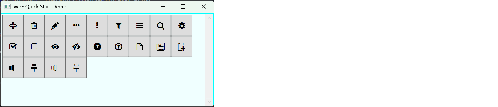

# [<](../../README.md)

## WPF Quick Start

This example uses standard WPF `Button` controls.  
The window defines an empty `WrapPanel`, and the `InitAsync` method fills it with glyph-bearing buttons at runtime.



---

### XAML

The page contains a `WrapPanel` that will be populated with glyph buttons.

```xml
<Window x:Class="QuickStart.Wpf.Demo.MainWindow"
        xmlns="http://schemas.microsoft.com/winfx/2006/xaml/presentation"
        xmlns:x="http://schemas.microsoft.com/winfx/2006/xaml"
        Title="MainWindow" Height="450" Width="800">

    <WrapPanel x:Name="WrapPanelIcons"
               Margin="10"
               Orientation="Horizontal" />
</Window>
```

---

### Code Behind

A `FontFamily` is created using a `pack://application` URI that points to the imported `.ttf` file.  
Each glyph from the built-in `IconBasics` enum is rendered into a `Button`.  
`TextOptions` ensures crisp, pixel-aligned icon edges.

```csharp
using IVSoftware.Portable;
using System.Windows;
using System.Windows.Controls;
using System.Windows.Media;

namespace QuickStart.Wpf.Demo
{
    public partial class MainWindow : Window
    {
        public MainWindow()
        {
            InitializeComponent();
            _ = InitAsync();
        }

        async Task InitAsync()
        {
            await GlyphProvider.WaitAsync(); // optional warm-up

            if (GlyphProvider.Providers[typeof(GlyphProvider.IconBasics)] is { } provider)
            {
                var fontFamily = new FontFamily(
                    baseUri: new Uri("pack://application:,,,/"),
                    familyName: $"./Resources/Fonts/{provider.Name}/font/#{provider.Name}");

                foreach (var icon in Enum.GetValues<GlyphProvider.IconBasics>())
                {
                    var button = new Button
                    {
                        FontFamily = fontFamily,
                        Content = icon.ToGlyph(),
                        Width = 50,
                        Height = 50,
                        Margin = new Thickness(4)
                    };

                    // Ensures crisp rendering of monochrome font-glyph icons
                    TextOptions.SetTextFormattingMode(button, TextFormattingMode.Display);
                    TextOptions.SetTextRenderingMode(button, TextRenderingMode.ClearType);
                    TextOptions.SetTextHintingMode(button, TextHintingMode.Fixed);

                    WrapPanelIcons.Children.Add(button);
                }
            }
        }
    }
}
```

---

### Notes

- WPF requires a **pack URI** to reference `.ttf` fonts included in the project.  
- For icon fonts, **`TextFormattingMode.Display` + `TextRenderingMode.ClearType`** produce visibly sharper edges than WPF’s defaults.  
- DPI, scaling, and font hinting all influence glyph clarity; these settings ensure predictable results across displays.

