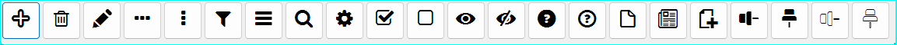
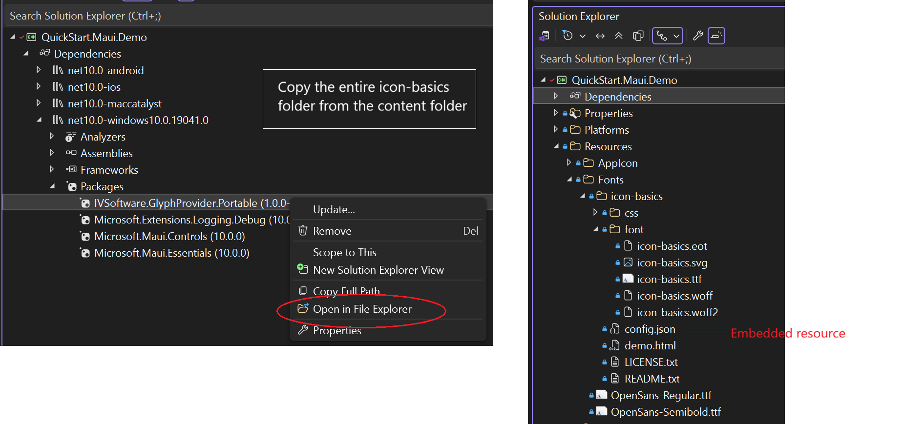



## IVSoftware.GlyphProvider.Portable  [[GitHub](https://github.com/IVSoftware/IVSoftware.GlyphProvider.git)]

This micro utility works with custom [Fontello](https://www.fontello.com) webfont packages whether they contain a few glyphs or dozens. Each downloaded package comes with a `config.json` file that catalogs its contents. In Visual Studio, when the Build Action property of one or more `config.json` files is set to **Embedded Resource** they become discoverable by this utility to generate name-to-Unicode mappings for XAML and C#. Then, the `CreateEnumPrototypes()` method is run only once to assist you in defining `enum` structures that can be used directly to access the icons. This for example, makes them ideal for binding glyph properties in XAML that are visible to intellisense.

The Fontello archive also contains the `.ttf` font file itself and platforms have varying requirements for importing it (see table below). This guide walks through those prerequisites in each section, making sure everything is set up cleanly before we focus on how this utility streamlines glyph access so you don’t have to think about it again.
___

## Quick Start - `icon-basics.ttf`

 

To get you  up and running, this package comes with a small ready-made Fontello font or you can make your own selections from the hundreds of icons on the Fontello site. 
___
- _If you like, you can use _these_ selections as a springboard simply by importing the `config.json` to Fontello and renaming the font._ 
- _Their import capabilities means you can iterate on assembling a font, too. No need to get it exactly right the first time._
- _You can even import SVG icons you design from scratch using [Inkscape](https://inkscape.org/)._
- _Hosting **multiple** specialized icon sets (e.g. for editing, media control, social) is made easier with this utility._
___

### How To Copy

1. In your project, create the `Resources\Fonts` directory if it doesn't already exist. Locate and open the **content** folder in the NuGet and copy the entire **icon-basics** folder to the `Resources\Fonts` directory. 




2. Open the properties of `config.json` and set the Build Action property to Embedded Resource (that is, even for WPF it should be Embedded Resource and not Resource).

3. Open the properties of `icon-basics.ttf` and set its Build Action property to:
    - **MauiFont** for .NET MAUI
    - **Resource** for WPF (remembering that `config.json` is different - it's still an *embedded* resource.)
    - **EmbeddedResource** for WinForms.

___

## Using Named Enums

This NuGet package is shipped with an `enum` named `GlyphProvider.IconBasics`. To introduce this concept:

- *First* - We'll look at how this makes it easy to access the font glyphs.
- *Next* - In the [section](#generate-named-enums) below, we'll walk the steps to export  `enum` definition using the `GlyphProvider.CreateEnumPrototypes()` method.

The `enum` member is used to call the `ToGlyph()` extension. Here are some examples showing the various ways this can be useful.
___

### 1. Maui Button in Code Behind

A button showing an Edit icon.

```
Microsoft.Maui.Controls.Button button = new()
{
    HeightRequest = 50,
    WidthRequest = 50,
    BorderColor = Color.FromArgb("#444444"),
    Margin = new Thickness(1),
    Padding = 0,
    FontSize = 18,
    FontFamily = "icon-basics",
    Text = GlyphProvider.IconBasics.Edit.ToGlyph(),
};
```
___


### 2. List Button Glyphs for use in XAML

Using the `GlyphFormat.Xaml` option for the `ToGlyph()` extension.

```
var icons = Enum.GetValues<GlyphProvider.IconBasics>();
foreach (var icon in icons)
{
    Debug.WriteLine($"{icon.ToString().PadRight(20)}{icon.ToGlyph(GlyphFormat.Xaml)}");
}
```

#### Output from Debug
```
Add                 &#xE800;
Delete              &#xE801;
Edit                &#xE802;
EllipsisHorizontal  &#xE803;
EllipsisVertical    &#xE804;
Filter              &#xE805;
Menu                &#xE806;
Search              &#xE807;
Settings            &#xE808;
Checked             &#xE809;
Unchecked           &#xE80A;
Shown               &#xE80B;
Hidden              &#xE80C;
HelpCircled         &#xE80D;
HelpCircledAlt      &#xE80E;
DocEmpty            &#xE80F;
Doc                 &#xE810;
DocNew              &#xE811;
ParentPinCollapsed  &#xE812;
ParentPinExpanded   &#xE813;
ChildPinCollapsed   &#xE814;
ChildPinExpanded    &#xE815;
```
___

### 3. Button with Bound Glyph Property

This lightweight Button subclass takes `enum` values directly in XAML.

```
public class GlyphButton : Button
{
    public static readonly BindableProperty GlyphProperty =
        BindableProperty.Create(
            nameof(StdIconName),
            typeof(Enum),
            typeof(GlyphButton),
            default(Enum),
            propertyChanged: OnGlyphChanged);

    public Enum? StdIconName
    {
        get => (Enum?)GetValue(GlyphProperty);
        set => SetValue(GlyphProperty, value);
    }

    static void OnGlyphChanged(BindableObject bindable, object oldValue, object newValue)
    {
        if (newValue is Enum icon)
        {
            var button = (GlyphButton)bindable;
            button.FontFamily = icon.ToCssFontName();
            var textB4 = button.Text;
            if (IsGlyphChar(textB4?.FirstOrDefault()))
            {
                textB4 = textB4!.Substring(1).TrimStart();
            }
            button.Text =
                button.StdIconName?.ToGlyph() is { } glyph
                ? $"{glyph}    {textB4}"
                : textB4;
        }
    }

    static readonly char MinGlyph = '\uE000'; // typical PUA start
    static readonly char MaxGlyph = '\uF8FF'; // typical PUA end
    static bool IsGlyphChar(char? c) => c >= MinGlyph && c <= MaxGlyph;
}
```

#### XAML

```
<local:GlyphButton
    x:Name="CounterBtn"
    Text="Click me" 
    SemanticProperties.Hint="Counts the number of times you click"
    Clicked="OnCounterClicked"
    HorizontalOptions="Fill"
    Padding="0"
    FontSize="18"
    StdIconName="{x:Static gp:IconBasics.HelpCircledAlt}"/>
```

___

### Boosting the Cache

This platform agnostic snippet represents a canonical flow for _any_ client - there are no platform differences as far as this utility is concerned. Left to its own devices, the icon mapping functions will initialize themselves on the first access, but there might be a few ms of latency. To avoid this, warm up the cache as shown.

```
public partial class MainUI
{
    public MainUI()
    {
        InitializeComponent();
        _ = InitAsync();
    }

    private async Task InitAsync()
    {
        // Reduce the lazy "first time click" latency.
        await GlyphProvider.BoostCache();
    }
}
```

___

### Platform Quick Starts

Although this utility has no direct interactions with the `.ttf` file itself, this section is here to ensure a smooth onboarding experience taking framework differences into account. In particular, setting the Build Action property for the `.ttf` file itself is critical, and varies slightly depending on the framework:

| Platform   | Build Action | Notes |
|------------|--------------------------|-------|
| [**MAUI**](#maui-quick-start)     | `MauiFont`               | In `MauiProgram.cs` make an `AddFont` an entry in the `ConfigureFonts` block following the pattern shown e.g. for `OpenSans`. |
| [**WinForms**](#winforms-quick-start)  | `EmbeddedResource`       | Use the platform-specific NuGet `IVSoftware.GlyphProvider.WinForms` which implements the required `System.Drawing.PrivateFontCollection` for custom fonts. |
| [**WPF**](#wpf-quick-start)       | `Resource`               | XAML can reference `FontFamily` with `pack://application:,,,/#YourFont` syntax or do it in code-behind as shown un the full example below. |
___
These samples show just a few lines of code, but cover the idiosyncrasies of the main platforms.

[MAUI Quick Start](./IVSoftware.GlyphProvider.Portable/README/maui-quick-start.md) - Making sure to import the font in `MauiProgram.cs`

[WinForms Quick Start](./IVSoftware.GlyphProvider.Portable/README/winforms-quick-start.md) - Using the platform-specific NuGet to abstract `System.Drawing.PrivateFontCollection`.

[WPF Quick Start](./IVSoftware.GlyphProvider.Portable/README/wpf-quick-start.md) - How to succeed using the `pack` syntax in code behind.


___


## Generate Named Enums
>  Using the `GlyphProvider.CreateEnumPrototypes()` method.

To make it easy to generate an `enum` from the font, just make a temporary block when your app is loading using `GlyphProvider.CreateEnumPrototypes()`. This utility will reflect any and all `config.json` files marked as embedded resources in the `AppDomain` and dump the definitions as text - one `enum` for each config - and this text can be manually be copied as actual code.

```
private async Task InitAsync()
{
    // Reduce the lazy "first time click" latency.
    await GlyphProvider.BoostCache();
#if DEBUG
    // Generate one enum definition per config.json discovered in the assembly.
    // Many apps have more than one font kit, and multiple bundles will produce multiple enums.
    string[] prototypes = await GlyphProvider.CreateEnumPrototypes();

    Debug.Assert(
        prototypes.Any(),
        "You should also see prototypes for any additional config.json files " +
		"that you've marked as Embedded Resource. (Note: in WPF, this must be " +
		"EmbeddedResource - not Resource - for discovery to work.)"
    );

    var enumsGen =
        string.Join(
            $"{Environment.NewLine}{Environment.NewLine}",
            prototypes);

	// Copy the `enumsGen` from text visualizer to your code.
#endif
}
```

The block below shows what to expect in the visualizer. There will be one enum for each `config.json` file.

```
[CssName("icon-media-control")]
public enum StdIconMediaControl
{
	[CssName("stop")]
	Stop,

	[CssName("pause")]
	Pause,

	[CssName("to-end")]
	ToEnd,

	[CssName("to-end-alt")]
	ToEndAlt,

	[CssName("to-start")]
	ToStart,

	[CssName("to-start-alt")]
	ToStartAlt,

	[CssName("fast-fw")]
	FastFw,

	[CssName("fast-bw")]
	FastBw,

	[CssName("eject")]
	Eject,
}
```